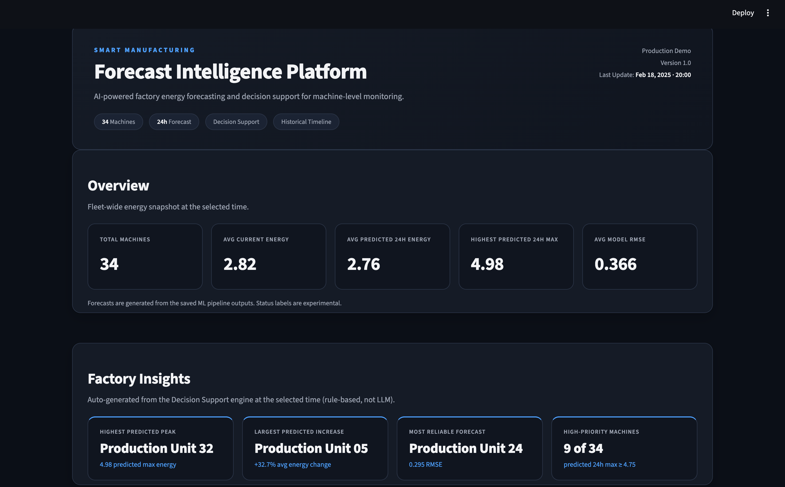
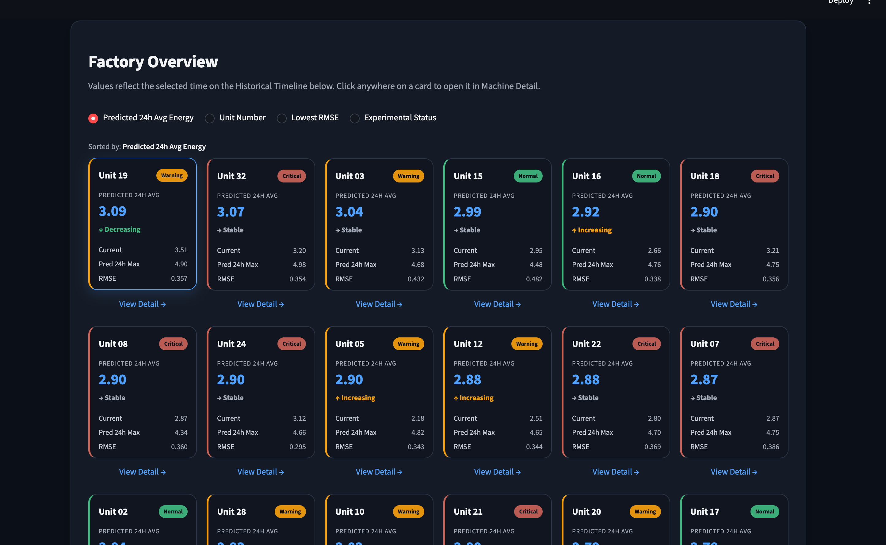
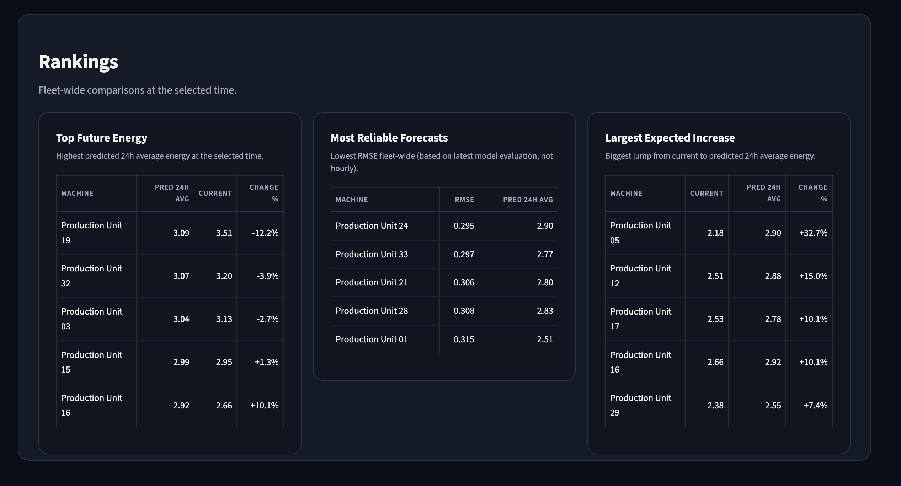
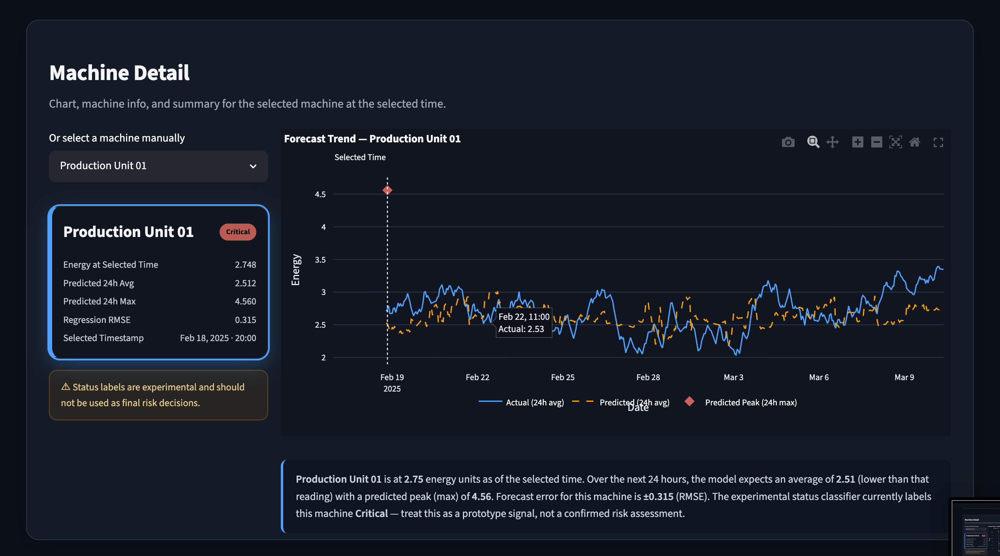

# Smart Manufacturing Forecast Intelligence Platform

An interactive decision-support dashboard for manufacturing energy
forecasting.

------------------------------------------------------------------------

## Overview

During my internship, I explored how machine learning forecasting
results could be presented in a way that supports operational decision
making instead of simply displaying prediction values.

This project builds an interactive dashboard on top of an existing
forecasting pipeline. It allows users to monitor factory-wide
conditions, inspect individual production units, compare forecast
results, and replay historical operating states through a single
interface.

The emphasis of this project is not developing a new forecasting model,
but transforming model outputs into an interpretable and practical
software application.

------------------------------------------------------------------------

## Why This Project

Many forecasting projects end after reporting model accuracy.

My goal was to investigate how prediction results could be organized
into a workflow that helps users understand forecasts, identify
important machines, and support operational decisions through
visualization and structured recommendations.

------------------------------------------------------------------------

## Features

### Factory Overview

-   Fleet-level KPI summary
-   Current and predicted energy consumption
-   Highest predicted energy peak
-   Forecast reliability (RMSE)

### Factory Insights

-   Highest predicted peak
-   Largest expected increase
-   Most reliable forecast
-   High-priority production units

### Production Unit Dashboard

Each production unit provides:

-   Current energy
-   Predicted 24-hour average energy
-   Predicted peak energy
-   Forecast RMSE
-   Trend information
-   Experimental status

Selecting a production unit updates the detailed analysis automatically.

### Ranking Panels

The dashboard provides multiple ranking views:

-   Highest future energy
-   Most reliable forecasts
-   Largest predicted increase

### Machine Detail

Detailed analysis includes:

-   Historical energy trend
-   Forecast visualization
-   Prediction summary
-   Model statistics
-   Automatic interpretation

### Decision Support

A rule-based decision engine generates:

-   Risk level
-   Forecast quality
-   Possible cause
-   Recommended action
-   Confidence note

The current implementation is intentionally rule-based to ensure
transparency and interpretability.

### Historical Timeline

The Historical Timeline replays factory conditions across the evaluation
period.

Changing the selected timestamp updates:

-   KPI summary
-   Factory Insights
-   Production Unit cards
-   Ranking panels
-   Machine Detail
-   Decision Support

------------------------------------------------------------------------

## Dashboard Preview

### Overall Dashboard



### Production Unit Overview



### Rankings



### Machine Detail



------------------------------------------------------------------------

## Project Structure

``` text
smart_manufacturing_forecast/
├── app.py
├── requirements.txt
├── README.md
├── src/
│   └── decision_engine.py
├── results/
├── assets/
└── docs/
```

------------------------------------------------------------------------

## Technology Stack

-   Python
-   Streamlit
-   Plotly
-   Pandas
-   NumPy
-   Scikit-learn

------------------------------------------------------------------------

## Running the Project

Install dependencies:

``` bash
pip install -r requirements.txt
```

Run the dashboard:

``` bash
streamlit run app.py
```

------------------------------------------------------------------------

## Current Scope

This project focuses on presenting forecasting outputs through an
interactive decision-support interface.

The current prototype:

-   Reads prediction outputs from an existing forecasting pipeline
-   Visualizes machine-level forecasts
-   Supports historical replay
-   Generates interpretable operational recommendations

The current prototype does **not**:

-   Retrain forecasting models
-   Collect live sensor data
-   Connect directly to production systems

------------------------------------------------------------------------

## Future Work

Planned extensions include:

-   Live sensor integration
-   Multivariate forecasting
-   LLM-assisted operational reporting
-   Cloud deployment
-   Multi-factory monitoring

------------------------------------------------------------------------

## Acknowledgements

This project was developed during my Smart Manufacturing internship.

It represents my exploration of how machine learning forecasting can be
transformed into a practical decision-support application for
manufacturing environments.
